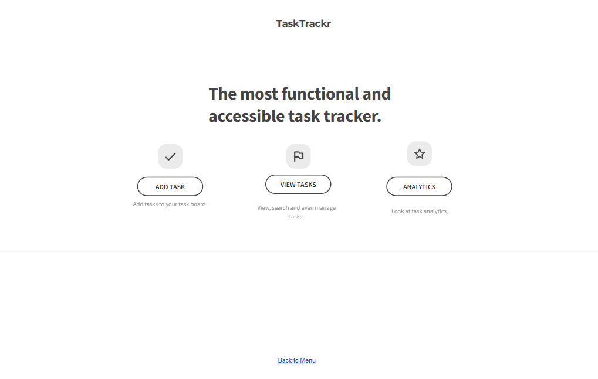

# Web Dev Starter Code

## Project Spec

For my final project, I am creating a TODO app called TaskTrackr. This app is designed to help users create, organize, and manage their tasks from anywhere. The goal is to offer a clean, user-friendly interface for planning out daily responsibilities, organizing longer-term goals, and tracking productivity. Users will be able to easily retrieve all tasks with a button click, delete individual tasks, and search or filter their tasks based on categories such as due date and priority level. These features will provide both broad and fine-grained control over task management, empowering users to stay on top of their personal and professional responsibilities.

The site will be structured as a multi-page web application to improve usability and clarity. It will include a landing page that serves as the homepage with introductory information and navigation. The Add Task page will feature a form where users can enter information about new tasks—this data will be submitted and stored using AWS. The View Tasks page will list current tasks and include functionality for filtering, sorting, and deletion. Lastly, there will be an Analytics page, which will display visual summaries of completed tasks and overall task trends, helping users better understand their productivity over time.

I'm building this app because I personally enjoy staying organized and planning out my days or weeks in advance. I believe TaskTrackr will be a helpful tool not just for myself but for anyone who finds value in structure and planning. The target audience includes students, freelancers, remote workers, busy professionals, and generally anyone who needs help managing a to-do list or organizing their daily life.  That ultimately is the goal of the app is to help anyone who wants to be more organized in professional or personal life.

TaskTrackr will manage a variety of data types. Tasks will have a title (text), an optional description (text), a due date (date format), a priority level (low, medium, high), and a status indicating whether a task is complete (boolean). In the future, I could include additional data types such as numbers, float values (for hours expected to complete a task), or tags (for categorization). This data will be stored in the backend using JavaScript arrays or objects and potentially managed in a NoSQL or SQL database via AWS services, depending on project scope.

Core features include the ability to add, delete, view, and filter tasks. Filtering will let users view tasks based on priority, due date, or completion status. These features will be split across separate HTML pages for better organization and to meet project requirements.

I also have several stretch goals that I’d love to incorporate. These include the ability to mark a task as complete with a checkbox (without deleting it), drag-and-drop functionality for rearranging tasks, email notifications as reminders for upcoming tasks, and user authentication to personalize data and improve security. I’m also considering adding offline capabilities and a dark mode toggle to improve accessibility and user experience.

Ultimately, I hope TaskTrackr will be a practical, intuitive, and expandable productivity tool that is easy to use and visually appealing.

## Project Wireframe

TODO: Replace the wireframe below with you own design.

